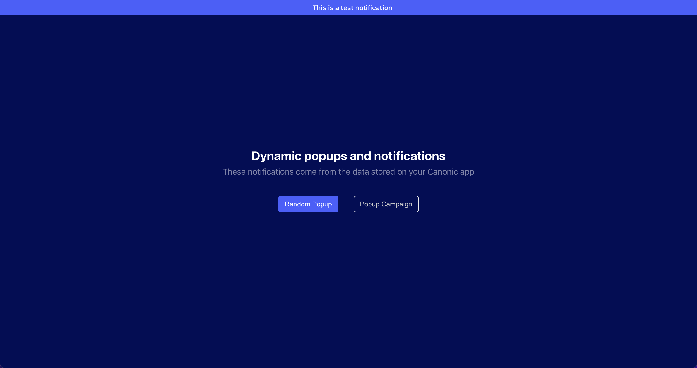
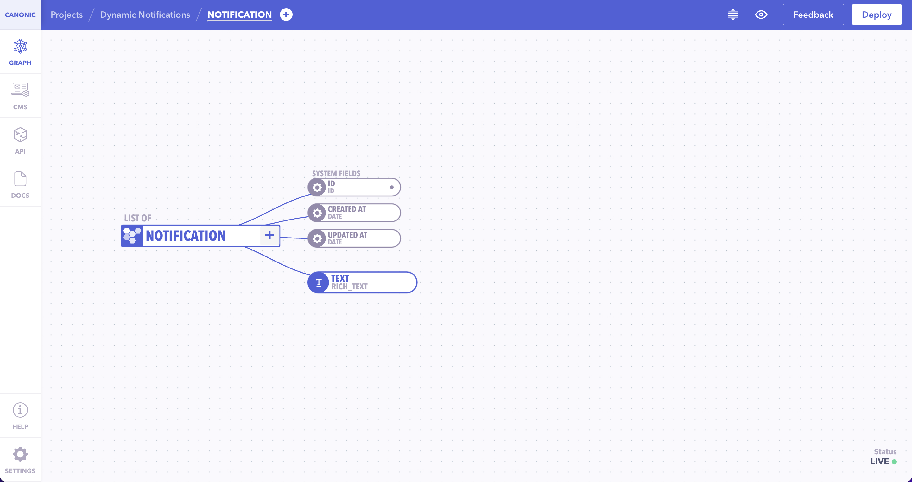
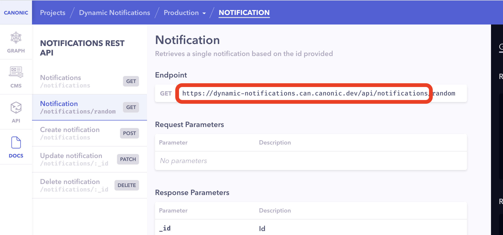

# Dynamic website notifications

A demo showcasing how dynamic notifications can be built on React and powered by [Canonic](https://canonic.dev/) as the **Backend**.



**The text for the notification bar on the top is fetched dynamically from your Canonic project.**

## Links

#### [Demo](https://dynamic-notifications.netlify.app/?utm_source=github&utm_medium=organic_code&utm_campaign=30daysofcanonic_uc_1&utm_content=day_4)

#### [Tutorial]()

## Notification Types

---

### Random Popup

Fetches a random popup from your project's database and displays it. All the logic is stored in your project's backend so it is not exposed to your users.

### Popup Campaign

When we were doing [#30DaysOfCanonic](https://www.canonic.dev/30-days-of-canonic/?utm_source=github&utm_medium=organic_samples&utm_campaign=30daysofcanonic_uc_1&utm_content=day_4) we used this on our website to keep our users up to date with what was going on. The popup changed daily linking to the content we published on that day.

### Frontend

The frontend is a simple create-react-app. After cloning, install the dependencies.

```
yarn install
```

Then start the dev server

```
yarn start
```

### Backend

You can find the sample backend project **canonic-dynamic-prompts** [here](https://app.canonic.dev/dashboard/marketplace/samples) and clone it.



Copy the base url from the docs



Set the `API_ROOT` variable to the base url you just copied.

The example should now fetch data from the project you deployed.
